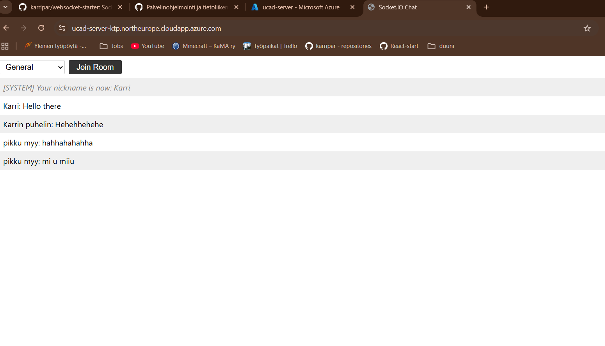
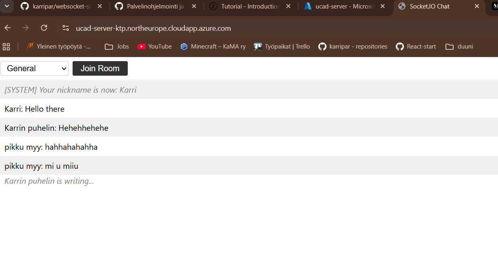
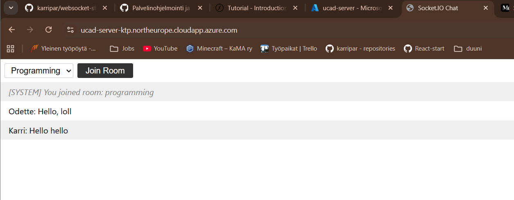

# Socket.io Chat Server

The solution is based on the example provided by [Socket.io](https://socket.io/docs/v4/tutorial/introduction).
I used TypeScript instead of the example JavaScript so it required a bit more maneuvering.

On top of the base features, the following was added:
- '<username> is typing...' indicator when someone else is typing.
- Setting a nickname visible to others (required to send a message).
- Three chat rooms with different topics, with their own message history stored with SQLite.

### Server running through Azure:

### Typing indicator

### Alternate rooms

